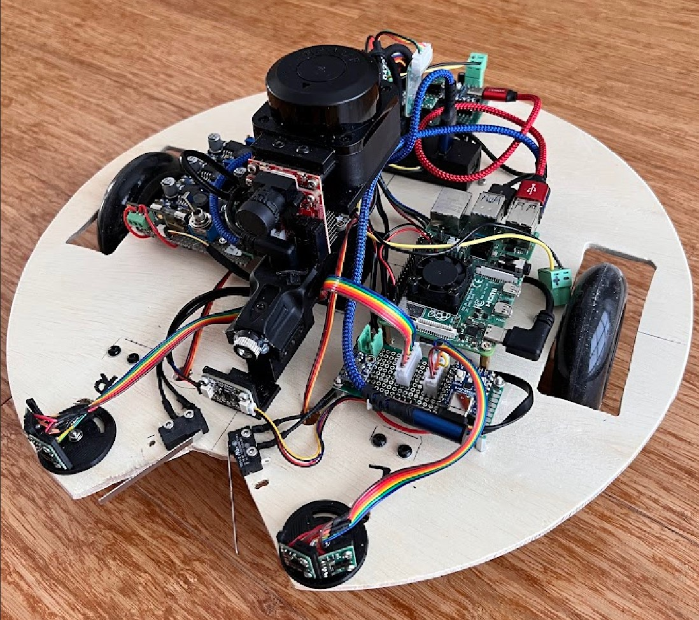
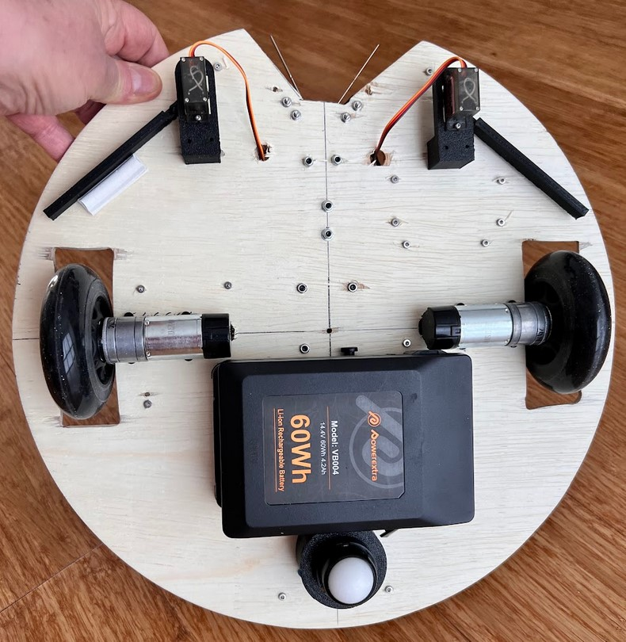
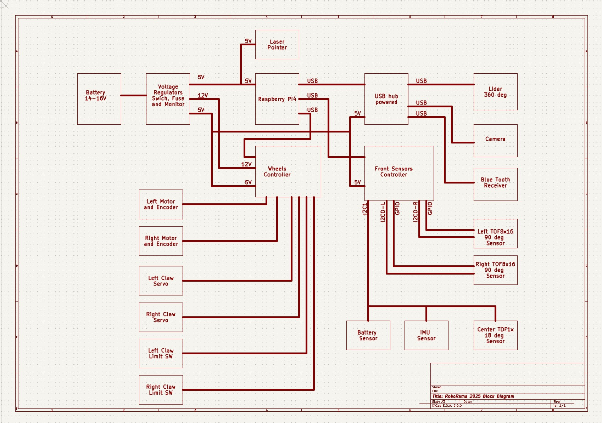
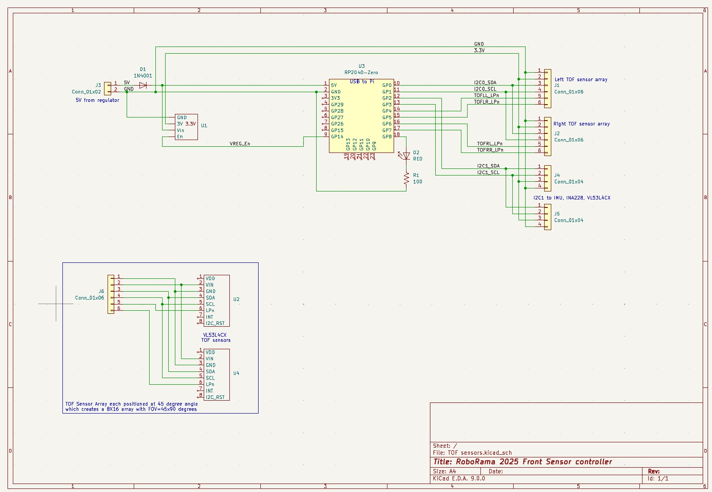

# DESCRIPTION
This ROS2 code is for the ROBORAMA 2025 Indoor robot competition 
The 2024 robot was stripped down and the motors, servos, camera, 3 VL53L5 sensors, IMU were reused as well as the power, wheel and sensor modules 
New wheels and a RPLidar C1 and another VL53L5 sensor and a VL53L4 sensor were added 
It has a new plywood base which is about 16" diameter (larger than my 3D printer can make) 
I am reusing and updating the wheel and sensor ROS2 modules 

## Pictures:
Top of robot: 
  
Bottom of robot: 
  

# Documentation
## Block diagram of electronics:
  

## Schematics:
  
