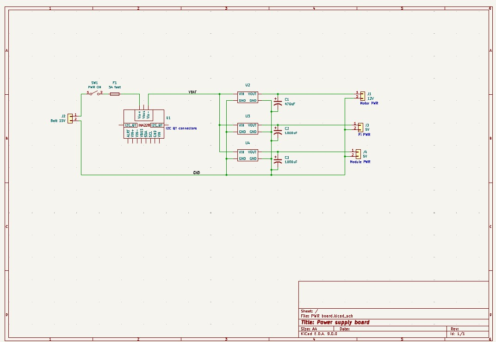
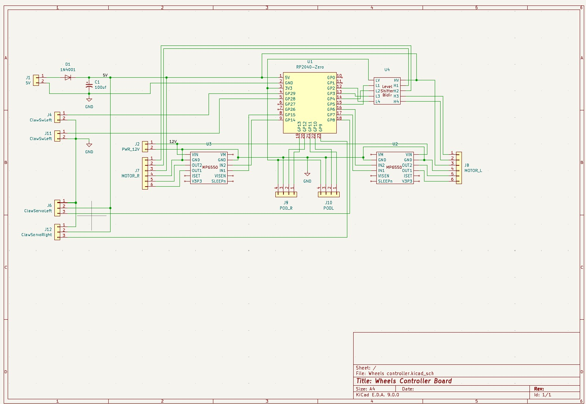

# DESCRIPTION
This ROS2 code is for the ROBORAMA 2025 Indoor robot competition 
The 2024 robot was stripped down and the motors, servos, camera, 3 VL53L5 sensors, IMU were reused as well as the power, wheel and sensor modules 
New wheels and a RPLidar C1 and another VL53L5 sensor and a VL53L4 sensor were added 
It has a new plywood base which is about 16" diameter (larger than my 3D printer can make) 
I am reusing and updating the wheel and sensor ROS2 modules 

## Pictures:
Top of robot: 
  
Bottom of robot: 
  

# Documentation
## Block diagram of electronics:
The Rasberry Pi does not supply power directly to any of the peripherals 
The peripheral power is supplied from the power supply module 
The powered USB hub supplies power for to the peripherals connected to it 
  

## Schematics:
Power Supply board: 
There are 3 voltage regulators. 12V for the wheel motors. A 5V for the Pi and 5V for the peripherals 
The Peripheral 5V are bumped up 0.7 volts or so to compensate for the reverse protection diodes 
  

Front Sensors Controller board: 
The 5V input has a reverse protection diode, the 5V input level is expected to be 5.7V or so to compensate for the diod drop. The 3.3V to the sensors is from a regulator since they need more power than the uC internal regulator can safely generate. The 3.3V regulator can be disabled to reset the VL53L4CX sensors before assigning I2C addresses. The RP2040 module 3.3V output is not used. 
The four VL53L4CX sensors are on the I2C0 bus and the I2C1 bus is a QT connector which connects to the other sensors. 
The wiring of the VL53L4CX sensors is shown on the schematic, this wiring is not on the Front Sensor Controller board. 
  

Wheels Controller board: 
The 5V input has a reverse protection diode, the 5V input level is expected to be 5.7V or so to compensate for the diod drop. The RP2040 module 3.3V output powers the pod encoder sensors which do not require a lot of power. 
The 12V powers the MP6550 Wheel motor controllers which are connected with a 6 pin cable. The cable also has the motor encoder signals that are powered by 5V and the level shifter connects the signals to the 3.3V GPIO pins of the controller. There is also 4 pin connectors to pod odomtry sensors used on the 2024 robot but not this year. 
The 3 pin connectors are for the servos that control the claws operate on 5V and work with the 3.3V GPIO signals. There is a set 2 pin connectors for the limit switches that trip when the can is firmly gripped by the claws, the GPIO pins are configured with internal pull-up resistors so the switches pull the pin levels low when tripped. 
  
